<!-- RAINBOW LINE TOP -->

  

<!-- HEADER ANIMATION -->

  

 

<h1 align="center">Hi there 👋, I'm Dinh</h1>

🏫 About me: I am an Information Technology student.

📖 My interests: Cybersecurity, Software Development, and Web Applications.

👨🏻‍💻 Currently focusing on: Web Development, System Design, and Application Security.

🚀 My goal: Building practical, secure, and user-friendly software products.

📫 Connect with me:

 

  
  &nbsp;
  
  &nbsp;
  

 

## 🐱 Vibe check

  

---

<!-- GITHUB CONTRIBUTION SNAKE -->

  

  
  

 

  ⭐️ <i>Architected with 1% Skill and 99% Imagination</i>
  • <b>graperu</b> 🤡

